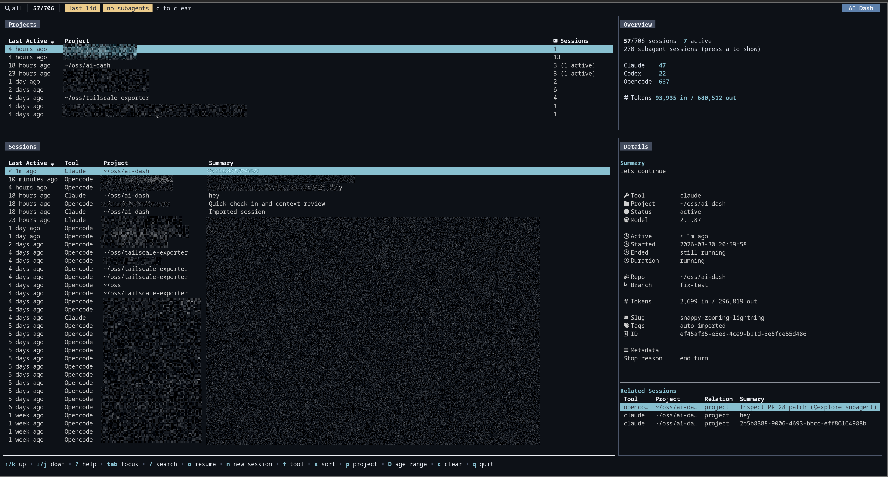

# AI Dash



A terminal UI for browsing coding sessions across multiple tools from local transcripts, session logs, and databases. It currently supports Claude Code, Codex, and OpenCode.

## What it does

- Parses Claude Code JSONL transcripts, Codex session logs, and the OpenCode SQLite database
- Fuzzy search across sessions, live as you type
- Filter by tool, project, or date range
- Sort per table (last active, tool, project, summary)
- Project overview with session counts and tool breakdown
- Detail pane with tokens, cost, metadata, related sessions
- Picks up subagent/child sessions (Claude subagents, OpenCode parent/child)
- Nerd Font icons when available, falls back to Unicode
- Resume or start sessions from the dashboard

## Install

### From source

```bash
git clone https://github.com/adinhodovic/ai-dash.git
cd ai-dash
make build
./ai-dash
```

### Binary

Pre-built binaries are available on the [releases page](https://github.com/adinhodovic/ai-dash/releases).

```bash
curl -L https://github.com/adinhodovic/ai-dash/releases/latest/download/ai-dash-linux-amd64 -o ai-dash
chmod +x ai-dash
```

## Configuration

Config file: `~/.config/ai-dash/config.json`

### Sources

Sessions are discovered from default paths. Override them if needed:

| Tool | Default path | Config key |
|------|-------------|------------|
| OpenCode | `~/.local/share/opencode/opencode.db` | `opencode_path` |
| Codex | `~/.codex/config.toml` | `codex_path` |
| Claude Code | `~/.claude/projects/` | `claude_path` |

### Options

```json
{
  "$schema": "https://raw.githubusercontent.com/adinhodovic/ai-dash/main/config.schema.json",
  "terminal": "ghostty",
  "poll_interval": "10s",
  "default_age_filter": "14d",
  "default_tool": "claude",
  "auto_select_tool": false,
  "nerd_font": null,
  "age_presets": ["1h", "1d", "3d", "7d", "14d", "30d"]
}
```

| Option | What it does | Default |
|--------|-------------|---------|
| `terminal` | Terminal emulator used to open sessions | `$TERMINAL` |
| `poll_interval` | How often sessions reload | `10s` |
| `default_age_filter` | Default age filter used on load and when clearing filters | `14d` |
| `default_tool` | Pre-selected tool when pressing `n` | none |
| `auto_select_tool` | Skip the tool picker for new sessions | `false` |
| `nerd_font` | Force Nerd Font on/off, `null` auto-detects | auto |
| `age_presets` | Options when cycling with `D` | `1h,1d,3d,7d,14d,30d` |

Add the `$schema` line to get autocompletion in your editor. You can also run `ai-dash schema` to print it.

## Keys

| Key | Action |
|-----|--------|
| `/` | Search |
| `o` | Resume session |
| `n` | New session |
| `f` / `p` | Filter by tool / project |
| `s` | Cycle sort |
| `tab` | Switch focus |
| `?` | Full help |
| `q` | Quit |

## Development

```bash
make fmt
make build
make test
golangci-lint run ./...
```

## License

Apache License 2.0
